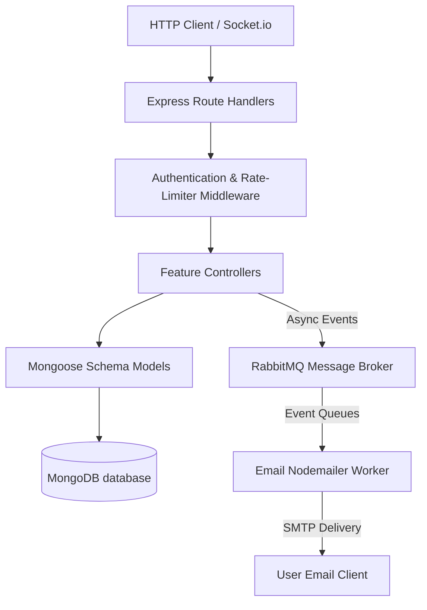

# TaskFlow Pro — Backend Architecture & Infrastructure Deep Dive

This document details the backend architectural patterns, service layers, schemas, and pipeline structures powering **TaskFlow Pro**. You can use this document for deep-technical architecture reviews, handovers, or client infrastructure discussions.

---

## 1. Architectural Architecture & Design Patterns

The TaskFlow Pro backend utilizes a **Clean Architecture/Controller-Service-Repository** paradigm implemented in Node.js with TypeScript.



### Key Architectural Guidelines:
*   **Separation of Concerns:** Route files define paths and mount authentication guards; controllers handle business logic and formatting responses; models control schemas, validation constraints, and database hooks.
*   **Asynchronous Processing:** Long-running/high-latency tasks (like SMTP email delivery) are completely decoupled from requests and deferred to a dedicated task queue.

---

## 2. Core Service Components & System Details

### 🔐 Authentication & Session Security
*   **Access Control:** Custom JWT middleware (`protect` in `auth.middleware.ts`) verifies identity via cookie tokens or standard `Authorization: Bearer` headers. 
*   **IP Protection / Cooldowns:** Express-rate-limiter guards sensitive authentication requests (such as `/api/users/login`) by enforcing temporary IP blocks after request thresholds are exceeded within a specific time frame.

### 💬 Live Websocket & Room Orchestration (`socket.ts`)
*   **Connection Lifecycle:** Socket sessions authenticate on startup using JWT Handshake verifications. Once connected, sockets are mapped by user ID.
*   **Interactive Discussion Rooms:**
    ```typescript
    // When opening a chat panel
    socket.on('join_task', (taskId) => socket.join(`task_${taskId}`));
    // When closing the chat panel
    socket.on('leave_task', (taskId) => socket.leave(`task_${taskId}`));
    ```
*   **Automatic Propagation:** When a new comment is posted to a task, the REST controller uses `getIO().to('task_taskId').emit('new_comment', populatedComment)` to push notifications to all users connected to that room.

### ⏰ Location Attendance Engine
*   **Formula Calculation:** Uses the Spherical Law of Cosines to calculate geodesic distance between coordinates on the Earth's surface:
    $$\Delta\sigma = \arccos\bigl(\sin\phi_1\sin\phi_2 + \cos\phi_1\cos\phi_2\cos(\Delta\lambda)\bigr)$$
*   **Geofence Enforcement:** Checks check-in coordinates against the default office anchor (`17.443500, 78.385000`). Distances $\le 10$ meters auto-approve the check-in as `Office Present`. Anything greater requires administrative approval.

---

## 3. Worker & Message Queue Infrastructure

To keep the application highly responsive, task assignments and status updates are managed asynchronously via **RabbitMQ**.

| Queue Name | Source Event | Payload Structure |
|---|---|---|
| `project_assigned_queue` | `project.controller.ts` | `{ projectId, projectName, assignees }` |
| `task_assigned_queue` | `task.controller.ts` | `{ taskId, taskTitle, assigneeId, projectId }` |
| `task_status_updated_queue` | `task.controller.ts` | `{ taskId, taskTitle, oldStatus, newStatus, creatorEmail }` |

### Email Worker Lifecycle:
1.  **Publish:** Controllers write JSON events to target queues using `publishToQueue()`.
2.  **Consume:** A background Nodemailer task consumer connects to the AMQP URL, processes messages sequentially, queries MongoDB for employee addresses, compiles HTML templates, and delivers emails.

---

## 4. Key Schemas & Database Configurations

### User Schema (`user.model.ts`)
*   **`userId`:** Auto-generates using custom pre-save hooks (`{YYYY}{random-digits}`).
*   **Password Hashing:** Uses 10-round `bcrypt` salts on pre-save actions.
*   **Selective Query Filters:** The `password` key has `select: false` set by default to prevent accidental exposures.

### Attendance Schema (`attendance.model.ts`)
*   **Keys:** `user` (reference to User ID), `timestamp`, `type` (Office Present / Remote Present / Clocked Out), `distanceMeters`, `status` (Approved / Pending / Rejected).
