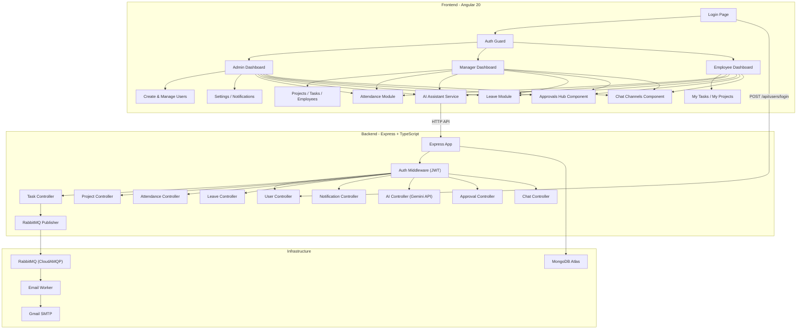

# TaskFlow Pro — Complete Product Documentation

> **Full-stack Enterprise Workforce Management Platform**
> Angular 20 Frontend · Express/TypeScript Backend · MongoDB · RabbitMQ · Capacitor (Android)

---

## Table of Contents

1. [Product Overview](#product-overview)
2. [Architecture Diagram](#architecture-diagram)
3. [Tech Stack](#tech-stack)
4. [Frontend (Angular)](#frontend-angular)
5. [Backend (Express / Node.js)](#backend-express--nodejs)
6. [Data Models (MongoDB)](#data-models-mongodb)
7. [API Reference](#api-reference)
8. [Authentication & Authorization](#authentication--authorization)
9. [Email Worker (RabbitMQ)](#email-worker-rabbitmq)
10. [Environment Setup](#environment-setup)
11. [Scripts & Commands](#scripts--commands)
12. [Project File Map](#project-file-map)

---

## Product Overview

**TaskFlow Pro** is an enterprise-grade workforce management platform that combines **task tracking**, **project management**, **employee management**, **attendance tracking**, **leave management**, **real-time notifications**, **team collaboration chat channels**, **unified approval workflows**, and an **AI assistant** — all in a single full-stack application.

### Core Capabilities

| Feature | Description |
|---------|-------------|
| 🔐 **Role-Based Access** | Three user roles — **Admin**, **Manager**, **Employee** — each with a dedicated dashboard and permissions |
| 📋 **Task Management** | Create, assign, track, and comment on tasks with priority levels and status workflows |
| 📁 **Project Management** | Create projects with deadlines, progress tracking, and team assignment |
| 👥 **Employee Management** | Full CRUD for employees with status management (active/inactive/hold) |
| ⏰ **Attendance Tracking** | GPS-based clock-in/out with Office & Remote presence, admin approval for remote work |
| 📅 **Leave Management** | Apply for leaves, track balances, audit logs, and approve/reject leave requests |
| 💬 **Team Chat & Channels** | Project-level communication channels, live task-level discussions, user mentions, and quick reply chips |
| stamp **Approval Workflows** | Unified approvals covering Leave, Remote Attendance, Expenses, Overtime, Shift Swaps, Documents, and Task Closures |
| 🔔 **Notifications** | In-app notification system with read/unread tracking and real-time socket delivery |
| 📧 **Email Alerts** | Background email notifications via RabbitMQ + Nodemailer (Gmail SMTP) |
| 🤖 **AI Assistant** | Built-in AI co-pilot powered by **Google Gemini 2.5 Flash** supporting auto-prioritization, workload balancing suggestions, leave anomalies, meeting summaries, and performance reports |
| 📱 **Mobile App** | Android APK via Capacitor |
| 🔑 **Password Reset** | OTP-based password recovery via email |

---

## Architecture Diagram



---

## Tech Stack

### Frontend
| Technology | Version | Purpose |
|------------|---------|---------|
| Angular | 20.x | SPA framework |
| TypeScript | 5.9 | Type-safe JavaScript |
| Bootstrap | 5.3 | UI component library |
| ng-bootstrap | 20.x | Angular-native Bootstrap widgets |
| RxJS | 7.8 | Reactive state management |
| Capacitor | 8.x | Native Android wrapper |
| Socket.io-client | 4.x | Real-time WebSocket communications |
| Hash Routing | — | `withHashLocation()` for Capacitor compatibility |

### Backend
| Technology | Version | Purpose |
|------------|---------|---------|
| Node.js + Express | 4.21 | REST API server |
| TypeScript | 6.x | Type-safe backend |
| Mongoose | 8.5 | MongoDB ODM |
| Socket.io | 4.x | WebSocket real-time server |
| bcryptjs | 3.x | Password hashing |
| jsonwebtoken | 9.x | JWT authentication |
| Nodemailer | 8.x | SMTP email delivery |
| amqplib | 2.x | RabbitMQ client |
| cookie-parser | 1.4 | HTTP cookie handling |
| cors | 2.8 | Cross-origin resource sharing |
| dotenv | 16.x | Environment variables |
| Google Gemini API | 2.5-flash | Large Language Model integrations |
| Jest | 29.x | Backend test runner framework |
| Supertest | 7.x | HTTP assertion library for integration tests |

---

## Frontend (Angular)

### Routing & Navigation

The app uses **three role-specific dashboard layouts**, each protected by the [authGuard](file:///c:/Users/rajsu/OneDrive/Desktop/TaskMS/TaskFlow-pro/src/app/guards/auth.guard.ts):

| Route Path | Role Required | Component | Description |
|------------|---------------|-----------|-------------|
| `/` | None | `LoginPage` | Login screen |
| `/dashboard` | `admin` | `AdminDashboard` | Admin home with stats |
| `/dashboard/action` | `admin` | `Createandmanage` | User creation & management |
| `/dashboard/settings` | `admin` | `Settings` | Profile & app settings |
| `/dashboard/notifications` | `admin` | `Notifications` | Notification center |
| `/dashboard/attendance` | `admin` | `AttendanceComponent` | Attendance overview |
| `/dashboard/leave-management` | `admin` | `LeaveManagement` | Leave history & management |
| `/dashboard/approvals` | `admin` | `ApprovalHub` | Unified Approvals Panel |
| `/dashboard/channels` | `admin` | `ChatChannels` | Team Project Channels |
| `/manager-dashboard` | `manager` | `ManagerDashboard` | Manager home |
| `/manager-dashboard/projects` | `manager` | `Projects` | Project management |
| `/manager-dashboard/tasks` | `manager` | `Tasks` | Task management |
| `/manager-dashboard/employees` | `manager` | `Employees` | Team view |
| `/manager-dashboard/settings` | `manager` | `Settings` | Settings |
| `/manager-dashboard/notifications` | `manager` | `Notifications` | Notifications |
| `/manager-dashboard/attendance` | `manager` | `Attendance` | Attendance |
| `/manager-dashboard/approvals` | `manager` | `ApprovalHub` | Unified Approvals Panel |
| `/manager-dashboard/channels` | `manager` | `ChatChannels` | Team Project Channels |
| `/employee-dashboard` | `employee` | `EmployeeDashboard` | Employee home |
| `/employee-dashboard/my-tasks` | `employee` | `MyTasks` | Personal task list |
| `/employee-dashboard/my-projects` | `employee` | `MyProjects` | Assigned projects |
| `/employee-dashboard/settings` | `employee` | `Settings` | Settings |
| `/employee-dashboard/notifications` | `employee` | `Notifications` | Notifications |
| `/employee-dashboard/attendance` | `employee` | `Attendance` | Attendance |
| `/employee-dashboard/approvals` | `employee` | `ApprovalHub` | Unified Approvals Panel |
| `/employee-dashboard/channels` | `employee` | `ChatChannels` | Team Project Channels |

### Auth Guard Logic

The [authGuard](file:///c:/Users/rajsu/OneDrive/Desktop/TaskMS/TaskFlow-pro/src/app/guards/auth.guard.ts) performs:
1. Checks `localStorage` for a `user` JSON object
2. Parses the user's role
3. Validates that the role matches the route prefix (`/dashboard` → admin, `/manager-dashboard` → manager, `/employee-dashboard` → employee)
4. Redirects unauthorized users to the login page

### AI Assistant Service

The [AiService](file:///c:/Users/rajsu/OneDrive/Desktop/TaskMS/TaskFlow-pro/src/app/services/ai.service.ts) provides two main features:

1. **`generateBreakdown(title, description)`** — Returns an AI-generated subtask checklist based on keyword analysis of the task title.
2. **`chatWithAssistant(message)`** — An AI co-pilot chat that reads from `localStorage` to provide context-aware responses.

Both functions query the backend, which interacts with the **Google Gemini 2.5 Flash** models via native fetch requests.

### Environment Configuration

The [environment.ts](file:///c:/Users/rajsu/OneDrive/Desktop/TaskMS/TaskFlow-pro/src/environments/environment.ts) is auto-generated by `set-env.js`:
```typescript
export const environment = {
  production: false,
  apiUrl: 'http://localhost:5000/api'  // Points to the backend
};
```

### Mobile & Multi-Device Responsive Layouts

TaskFlow Pro is optimized for multiple devices (Desktop, Tablet, Mobile) and native wrapper environments (Capacitor Android):

1. **Safe Area Inset Support**: Handles camera notches and home screen indicators on Android/iOS via custom styling variables:
   - `--safe-top: env(safe-area-inset-top, 0px);`
   - `--safe-bottom: env(safe-area-inset-bottom, 0px);`
2. **Glassmorphic AI Co-Pilot Panel**: Slide-out panels use glassmorphic backdrops (`backdrop-filter: blur(20px)`) that dynamically adapt to the available screen width.
3. **Adaptive Dashboard Views**: 
   - Dashboard layouts utilize CSS grid auto-fit/minmax columns to wrap stats card rows dynamically.
   - Header action items and profile labels are automatically collapsed or simplified on smaller screens.
   - Task discussion chat window opens in a full-screen bottom-sheet modal on mobile layouts.

---

## Backend (Express / Node.js)

### Server Entry Point

[server.ts](file:///c:/Users/rajsu/OneDrive/Desktop/Suraj%20Tradefinance/backend/src/server.ts):
1. Connects to MongoDB
2. Starts Express on configured port (default `5000`)
3. In **production mode**, auto-starts the email worker inline

### App Configuration

[app.ts](file:///c:/Users/rajsu/OneDrive/Desktop/Suraj%20Tradefinance/backend/src/app.ts) sets up:
- **CORS**: Allows target origins.
- **Body parsing**: JSON + URL-encoded
- **Cookie parsing**: For JWT token in cookies
- **Health check**: `GET /health` returns server status
- **404 handler**: Catches unmatched routes
- **Global error handler**: Logs stack traces, returns sanitized errors

### API Route Registration

| Base Path | Route File | Auth Required |
|-----------|------------|---------------|
| `/api/users` | [user.routes.ts](file:///c:/Users/rajsu/OneDrive/Desktop/Suraj%20Tradefinance/backend/src/routes/user.routes.ts) | **Yes** (except login, logout, recovery) |
| `/api/leaves` | [leave.routes.ts](file:///c:/Users/rajsu/OneDrive/Desktop/Suraj%20Tradefinance/backend/src/routes/leave.routes.ts) | **Yes** (all routes) |
| `/api/projects` | [project.routes.ts](file:///c:/Users/rajsu/OneDrive/Desktop/Suraj%20Tradefinance/backend/src/routes/project.routes.ts) | **Yes** (all routes) |
| `/api/tasks` | [task.routes.ts](file:///c:/Users/rajsu/OneDrive/Desktop/Suraj%20Tradefinance/backend/src/routes/task.routes.ts) | **Yes** (all routes) |
| `/api/notifications` | [notification.routes.ts](file:///c:/Users/rajsu/OneDrive/Desktop/Suraj%20Tradefinance/backend/src/routes/notification.routes.ts) | **Yes** (all routes) |
| `/api/attendance` | [attendance.routes.ts](file:///c:/Users/rajsu/OneDrive/Desktop/Suraj%20Tradefinance/backend/src/routes/attendance.routes.ts) | **Yes** (all routes) |
| `/api/ai` | [ai.routes.ts](file:///c:/Users/rajsu/OneDrive/Desktop/Suraj%20Tradefinance/backend/src/routes/ai.routes.ts) | **Yes** (all routes) |

---

## Data Models (MongoDB)

### User Model — [user.model.ts](file:///c:/Users/rajsu/OneDrive/Desktop/Suraj%20Tradefinance/backend/src/models/user.model.ts)

| Field | Type | Required | Notes |
|-------|------|----------|-------|
| `userId` | String | Auto-gen | Format: `{YYYY}{2-digit random}`, unique |
| `firstName` | String | ✅ | 2–50 chars |
| `lastName` | String | ✅ | 2–50 chars |
| `email` | String | ✅ | Unique, lowercase, validated |
| `password` | String | ✅ | Min 6 chars, `select: false` (hidden by default) |
| `role` | Enum | No | `admin` · `employee` · `manager` |
| `contactNumber` | String | ✅ | 10–15 digits |
| `empStatus` | Enum | No | `active` · `inactive` · `hold` |

---

### Task Model — [task.model.ts](file:///c:/Users/rajsu/OneDrive/Desktop/Suraj%20Tradefinance/backend/src/models/task.model.ts)

| Field | Type | Required | Notes |
|-------|------|----------|-------|
| `taskId` | String | Auto-gen | Format: `TSK-{YYYY}-{4-char random}` |
| `title` | String | ✅ | |
| `description` | String | No | |
| `projectId` | ObjectId → Project | ✅ | |
| `assignedTo` | ObjectId → User | No | |
| `status` | Enum | No | `To Do` · `In Progress` · `Completed` |
| `priority` | Enum | No | `Low` · `Medium` · `High` |
| `dueDate` | Date | No | |
| `createdBy` | ObjectId → User | ✅ | |

---

### Project Model — [project.model.ts](file:///c:/Users/rajsu/OneDrive/Desktop/Suraj%20Tradefinance/backend/src/models/project.model.ts)

| Field | Type | Required | Notes |
|-------|------|----------|-------|
| `projectId` | String | Auto-gen | Format: `PRJ-{YYYY}-{4-char random}` |
| `projectName` | String | ✅ | |
| `description` | String | ✅ | |
| `startDate` | Date | ✅ | |
| `deadline` | Date | ✅ | |
| `status` | Enum | No | `In Progress` · `Completed` · `On Hold` |
| `priority` | Enum | No | `Low` · `Medium` · `High` |
| `progress` | Number | No | 0–100 |
| `assignees` | ObjectId[] → User | No | Array of assigned users |
| `createdBy` | ObjectId → User | ✅ | |

---

### Leave Model — [leave.model.ts](file:///c:/Users/rajsu/OneDrive/Desktop/Suraj%20Tradefinance/backend/src/models/leave.model.ts)

| Field | Type | Required | Notes |
|-------|------|----------|-------|
| `userId` | ObjectId → User | ✅ | Employee requesting leave |
| `leaveType` | Enum | ✅ | `sick` · `casual` · `earned` |
| `startDate` | Date | ✅ | |
| `endDate` | Date | ✅ | |
| `reason` | String | ✅ | Reason details |
| `status` | Enum | No | `Pending` · `Approved` · `Rejected` |
| `appliedAt` | Date | No | Auto default: now |

---

### Attendance Model — [attendance.model.ts](file:///c:/Users/rajsu/OneDrive/Desktop/Suraj%20Tradefinance/backend/src/models/attendance.model.ts)

| Field | Type | Required | Notes |
|-------|------|----------|-------|
| `user` | ObjectId → User | ✅ | |
| `timestamp` | Date | No | Default: now |
| `type` | Enum | ✅ | `Office Present` · `Remote Present` · `Clocked Out` |
| `coordinates` | String | ✅ | GPS coordinates |
| `distanceMeters` | Number | ✅ | Distance from office |
| `status` | Enum | No | `Approved` · `Pending` · `Rejected` |

---

### Notification Model — [notification.model.ts](file:///c:/Users/rajsu/OneDrive/Desktop/Suraj%20Tradefinance/backend/src/models/notification.model.ts)

| Field | Type | Required |
|-------|------|----------|
| `userId` | ObjectId → User | ✅ |
| `title` | String | ✅ |
| `message` | String | ✅ |
| `time` | Date | Default: now |
| `type` | Enum | `task` · `project` · `alert` · `system` |
| `isRead` | Boolean | Default: false |

---

### Approval Model — [approval.model.ts](file:///c:/Users/rajsu/OneDrive/Desktop/Suraj%20Tradefinance/backend/src/models/approval.model.ts)

| Field | Type | Required | Notes |
|-------|------|----------|-------|
| `type` | Enum | ✅ | `Leave` · `Attendance` · `Expense` · `Task Closure` · `Overtime` · `Shift Swap` · `Document` |
| `requester` | ObjectId → User | ✅ | User requesting the approval |
| `details` | Object | No | Contains `amount`, `description`, `documentUrl`, `targetDate`, `taskId`, `shiftSwapWith`, `hoursRequested` |
| `status` | Enum | No | `Pending` · `Approved` · `Rejected` (Default: `Pending`) |
| `approver` | ObjectId → User | No | User processing the approval |
| `remarks` | String | No | Notes added by the approver |
| `appliedAt` | Date | No | Default: now |

---

### ChatMessage Model — [chatMessage.model.ts](file:///c:/Users/rajsu/OneDrive/Desktop/Suraj%20Tradefinance/backend/src/models/chatMessage.model.ts)

| Field | Type | Required | Notes |
|-------|------|----------|-------|
| `channelType` | Enum | ✅ | `project` · `task` |
| `targetId` | ObjectId | ✅ | ID of the corresponding Project or Task |
| `sender` | ObjectId → User | ✅ | Message sender |
| `content` | String | ✅ | Message text |
| `mentions` | ObjectId[] → User | No | Mentioned users |
| `quickReply` | Boolean | No | Identifies pre-set quick response (Default: `false`) |

---

## API Reference

### 🔐 Users — `/api/users`

| Method | Endpoint | Auth | Description |
|--------|----------|------|-------------|
| `GET` | `/api/users` | ✅ Bearer | Get all users |
| `GET` | `/api/users/fetchuserlimit?page=1&limit=5` | ✅ Bearer | Paginated user listing |
| `GET` | `/api/users/countuserbyrole?role=employee` | ✅ Bearer | Count users by role |
| `GET` | `/api/users/countactiveusers?empStatus=active` | ✅ Bearer | Count active users |
| `GET` | `/api/users/employees` | ✅ Bearer | Get active employees only |
| `GET` | `/api/users/profile` | ✅ Bearer | Get current user's full profile |
| `PUT` | `/api/users/profile` | ✅ Bearer | Update current user's profile |
| `GET` | `/api/users/:id` | ✅ Bearer | Get user by MongoDB `_id` |
| `POST` | `/api/users` | ✅ Bearer | Create new user |
| `POST` | `/api/users/login` | ❌ | Login user |
| `POST` | `/api/users/logout` | ❌ | Logout user |
| `POST` | `/api/users/forgot-password` | ❌ | Send OTP to email |
| `POST` | `/api/users/reset-password` | ❌ | Reset password with OTP |
| `PUT` | `/api/users/:id` | ✅ Bearer | Update user details |

---

### 📅 Leaves — `/api/leaves` (🔒 All routes require JWT)

| Method | Endpoint | Auth | Role Required | Description |
|--------|----------|------|---------------|-------------|
| `POST` | `/api/leaves/apply` | ✅ | `employee` | Apply for leave |
| `GET` | `/api/leaves/my-leaves` | ✅ | `employee` | Get logged-in employee leaves history |
| `GET` | `/api/leaves/balance` | ✅ | `employee` | Get leave balances |
| `GET` | `/api/leaves/all` | ✅ | `admin`, `manager` | Get all employees' leaves |
| `GET` | `/api/leaves/pending` | ✅ | `admin`, `manager` | Get pending leave requests |
| `PUT` | `/api/leaves/:id/approve` | ✅ | `admin`, `manager` | Approve leave request |
| `PUT` | `/api/leaves/:id/reject` | ✅ | `admin`, `manager` | Reject leave request |

---

### 📋 Tasks — `/api/tasks` (🔒 All routes require JWT)

| Method | Endpoint | Description |
|--------|----------|-------------|
| `GET` | `/api/tasks` | Get all tasks |
| `GET` | `/api/tasks/:id` | Get single task by ID |
| `POST` | `/api/tasks` | Create task |
| `PUT` | `/api/tasks/:id` | Update task |
| `DELETE` | `/api/tasks/:id` | Delete task |
| `GET` | `/api/tasks/:id/comments` | Get all comments on a task |
| `POST` | `/api/tasks/:id/comments` | Add comment |

---

### 📁 Projects — `/api/projects` (🔒 All routes require JWT)

| Method | Endpoint | Description |
|--------|----------|-------------|
| `GET` | `/api/projects` | Get all projects |
| `GET` | `/api/projects/:id` | Get project by ID |
| `POST` | `/api/projects` | Create project |
| `PUT` | `/api/projects/:id` | Update project |
| `DELETE` | `/api/projects/:id` | Delete project |

---

### ⏰ Attendance — `/api/attendance` (🔒 All routes require JWT)

| Method | Endpoint | Auth | Description |
|--------|----------|------|-------------|
| `POST` | `/api/attendance/clock-in` | ✅ | Record clock-in |
| `POST` | `/api/attendance/clock-out` | ✅ | Record clock-out |
| `GET` | `/api/attendance/history` | ✅ | Get own attendance history |
| `GET` | `/api/attendance/all` | ✅ Admin | Get ALL users' attendance |
| `GET` | `/api/attendance/user/:userId` | ✅ | Get user history |
| `GET` | `/api/attendance/pending` | ✅ Admin | Get pending remote approvals |
| `PUT` | `/api/attendance/approve/:id` | ✅ Admin | Approve remote check-in |
| `PUT` | `/api/attendance/reject/:id` | ✅ Admin | Reject remote check-in |

---

### stamp Approvals — `/api/approvals` (🔒 All routes require JWT)

| Method | Endpoint | Auth | Role Required | Description |
|--------|----------|------|---------------|-------------|
| `POST` | `/api/approvals` | ✅ | Any | Submit new approval request (Expense, Overtime, Shift Swap, Doc, Task Closure) |
| `GET` | `/api/approvals` | ✅ | Any | Fetch approvals list (Admins/Managers: All, Employees: Self) |
| `PUT` | `/api/approvals/:id` | ✅ | `admin`, `manager` | Process approval status (Approve or Reject with remarks) |

---

### 💬 Chats — `/api/chats` (🔒 All routes require JWT)

| Method | Endpoint | Auth | Description |
|--------|----------|------|-------------|
| `GET` | `/api/chats/:channelType/:targetId` | ✅ | Fetch all messages in a channel room (project or task) |
| `POST` | `/api/chats` | ✅ | Send a new chat message, handles Socket room emits & user mentions |

---

## Authentication & Authorization

### Secure In-Memory & Cookie-Based Authentication Flow

TaskFlow Pro implements a secure **Cookie-Based Authentication System** to completely isolate sensitive authentication states from XSS vulnerabilities (such as reading from `localStorage`):

1. **HttpOnly Cookie Verification**:
   - **Access Token (`token`)**: Valid for 15 minutes, set automatically in an `HttpOnly`, secure, `SameSite=Lax` cookie.
   - **Refresh Token (`refreshToken`)**: Valid for 7 days, set automatically in an `HttpOnly`, secure, `SameSite=Lax` cookie, and saved securely on the User model in MongoDB for rotation checking.

2. **In-Memory AuthService**:
   - The [AuthService](file:///c:/Users/rajsu/OneDrive/Desktop/TaskMS/TaskFlow-pro/src/app/services/auth.service.ts) manages the application's authenticated user details inside a `currentUser$` BehaviorSubject in memory.
   - During application bootstrap, the user profile is fetched once from `GET /api/users/profile` to populate the state. No user details, tokens, or roles are stored inside `localStorage`.

3. **Angular HTTP Interceptor (`authInterceptor`)**:
   - Automatically clones all outgoing requests to set `withCredentials: true`, ensuring that cookies are attached to all API transactions.
   - Captures `401 Unauthorized` responses and silently requests a token renewal from `POST /api/users/refresh-token` before retrying the original HTTP call.

4. **Auth Guard & RBAC**:
   - The route guard [authGuard](file:///c:/Users/rajsu/OneDrive/Desktop/TaskMS/TaskFlow-pro/src/app/guards/auth.guard.ts) reads directly from `AuthService.currentUser$` to authenticate and authorize routes asynchronously based on user roles.

---

## Testing & Quality Assurance

TaskFlow Pro features comprehensive backend unit and integration test coverage powered by **Jest** and **Supertest**.

### Test Modules

1. **Authentication Middleware Tests** ([auth.middleware.test.ts](file:///c:/Users/rajsu/OneDrive/Desktop/Suraj%20Tradefinance/backend/src/middleware/auth.middleware.test.ts)):
   - Verifies that `protect` correctly rejects requests without tokens, blocks expired tokens, accepts valid Bearer/Cookie tokens, and passes decoded user identities downstream.
   - Asserts that the `authorize` RBAC guard grants access to authorized roles and denies it to others (returns 403 Forbidden).

2. **Geofencing & Distance Tests** ([geofence.test.ts](file:///c:/Users/rajsu/OneDrive/Desktop/Suraj%20Tradefinance/backend/src/utils/geofence.test.ts)):
   - Verifies the accuracy of coordinates distance checking using mock latitude and longitude calculations.

### Running Tests
Run the Jest test suite from the backend directory:
```bash
npm test
```

## Email Worker (RabbitMQ)

Background Nodemailer service consumes tasks to deliver assignment alerts asynchronously.

---

## Environment Setup

Configure `.env` in backend:
```env
PORT=5000
MONGODB_URI=mongodb://localhost:27017/tradefinance
JWT_SECRET=your_jwt_secret_here
EMAIL_USER=your-email@gmail.com
EMAIL_PASS=your-email-app-password
RABBITMQ_URL=amqps://...
GEMINI_API_KEY=your_google_gemini_api_key_here
```

---

## Scripts & Commands

### Frontend (`TaskFlow-pro`)
* **Start local dev server**: `npm start` (Runs environment configuration setup and starts `ng serve` on `http://localhost:4200`)
* **Production Build**: `npm run build` (Prepares compiled, optimized production web assets under `dist/TaskFlow-pro/`)
* **Capacitor Sync**: `npx cap sync` (Synchronizes compiled web assets and plugins to the native `android` folder)
* **Open in Android Studio**: `npx cap open android` (Opens the android project folder directly in Android Studio for native execution)

### Backend (`backend`)
* **Start local dev server**: `npm run dev` (Runs backend Express and WebSockets server on port `5000` with hot-reloading)
* **Start Email Worker**: `npm run worker` (Runs RabbitMQ consumer processing email delivery alerts asynchronously)
* **Run Unit/Integration Tests**: `npm test` (Executes the Jest test suite covering authentication middleware and geofence distance logic)

---

## Project File Map

### Frontend — `TaskFlow-pro/src/app/`
```
src/app/
├── app.routes.ts
├── guards/auth.guard.ts
├── interceptors/auth.interceptor.ts
├── services/
│   ├── ai.service.ts
│   └── auth.service.ts              # In-memory authentication state manager
├── leave-management/                # Leave management interface
├── approval-hub/                    # Unified approvals center
├── chat-channels/                   # Team project chat channels
├── error-page/                      # Catch-all routing errors
└── ...
```

### Backend — `backend/src/`
```
src/
├── app.ts
├── server.ts
├── middleware/
│   ├── auth.middleware.ts
│   └── auth.middleware.test.ts      # Authentication Jest integration tests
├── models/
│   ├── user.model.ts
│   ├── task.model.ts
│   ├── project.model.ts
│   ├── leave.model.ts
│   ├── attendance.model.ts
│   ├── notification.model.ts
│   ├── approval.model.ts
│   └── chatMessage.model.ts
├── controllers/
│   ├── user.controller.ts
│   ├── task.controller.ts
│   ├── project.controller.ts
│   ├── leave.controller.ts
│   ├── attendance.controller.ts
│   ├── approval.controller.ts
│   └── ai.controller.ts
├── routes/
│   ├── user.routes.ts
│   ├── task.routes.ts
│   ├── project.routes.ts
│   ├── leave.routes.ts
│   ├── attendance.routes.ts
│   ├── approval.routes.ts
│   ├── chat.routes.ts
│   └── ai.routes.ts
├── utils/
│   ├── rabbitmq.ts
│   ├── socket.ts
│   ├── geofence.ts                  # Haversine distance calculator utility
│   └── geofence.test.ts             # Geofencing unit tests
├── seed.ts                          # Seed 40 test users
└── seedProjects.ts                  # Seed sample projects
```
```

---

> [!TIP]
> **For testing APIs**, use tools like Postman or Thunder Client. First call `POST /api/users/login` to get a JWT token, then include it as `Authorization: Bearer <token>` in all protected routes.
